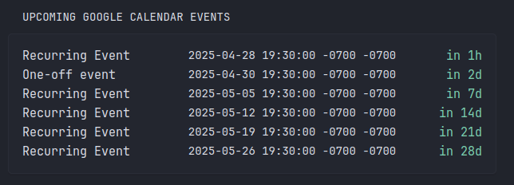

## Google Calendar List Extension for https://github.com/glanceapp/glance

You can use this extension to list Google Calendar events in your Glance dashboard.



You can use the following options to run the app:
1. [Python](./Python) - Docker app
2. [Javascript](./Javascript) - I am hosting this on Cloudflare Workers  

## To get started:
1. Prepare Google API Credentials
    1. Go to [Google Cloud Console](https://console.cloud.google.com/).
    2. Create a new project (or reuse one).
    3. Enable Google Calendar API.
    4. Create OAuth 2.0 Credentials:  
    App type = Web application  
    Add redirect URI: http://localhost:8075 [This does not really matter]  
    **You get**:  
    - CLIENT_ID  
    - CLIENT_SECRET  
    Save these.
2. Get the Authentication Code (Manual one-time step)
    1. You need to get an auth code. Replace with your ClientId & Paste the following into your browser:  
    ```
    https://accounts.google.com/o/oauth2/v2/auth?client_id=YOUR_CLIENT_ID&redirect_uri=http://localhost:8075&response_type=code&scope=https://www.googleapis.com/auth/calendar.readonly&access_type=offline&prompt=consent
    ```
    2. Login with your Google Account.
    3. It will redirect you to http://localhost:8075?code=XYZ
    4. Copy the XYZ part.
    
3. Exchange Authentication Code for Refresh Token 
    1. Paste CLIENT_ID, CLIENT_SECRET & Auth code (from last step) in [get_refresh_token.py](./Python/get_refresh_token.py).
    2. Run this file (or make similar post request to Google's OAuth servers using your own client or curl).
    3. Copy the refresh_token in json response.

4. Configure and run service 
    - Python
        1. Save the CLIENT_ID, CLIENT_SECRET and REFRESH_TOKEN in docker-compose.yml
        2. Run <code>docker compose up --remove-orphans -d</code>
        3. This service will run on port 8075 unless configured otherwise.
    - Javascript
        - Store these values in app or configure using [Cloudflare Worker KV](https://developers.cloudflare.com/kv/) or [Cloudflare Workers Secrets](https://developers.cloudflare.com/workers/configuration/secrets/)

5. Glance Configuration:  
- Place the following configuration into your Glance configuration.  
- Replace the GOOGLE_CALENDAR_SERVER with your service's endpoint.
```
- type: custom-api
    title: Upcoming Google Calendar Events
    cache: 1h
    url: ${GOOGLE_CALENDAR_SERVER}
    template: |
    <div>
        {{ range .JSON.Array "events" }}
        <div style="display: flex; justify-content: space-between; align-items: flex-start;">
        <div class="size-h3" style="text-align: left; width: 175px;">{{ .String "summary" }}</div>
        <div class="size-h4" style="text-align: left;">{{ .String "start.dateTime" | parseLocalTime "rfc3339" }}</div>
        <div class="color-primary size-h3" style="text-align: right; width: 75px;" {{ .String "start.dateTime" | parseTime "rfc3339" | toRelativeTime }}></div>
        </div>
    {{ end }}
    </div>
```

## NOTE:
If the ability to parse data from parent request is added to subrequest in Glance (https://github.com/glanceapp/glance/issues/563), then backend server might not be needed as Google's API can directly be queries after OAuth flow.
