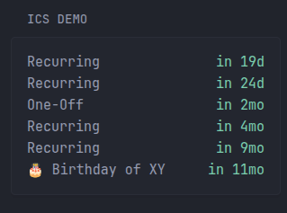

# iCal Event Widgets for Glance

A simple extension that fetches events from an iCal (ICS) feed and displays them as a custom widget in Glance.

## Prerequisites

* [Docker](https://www.docker.com/) and [Docker Compose](https://docs.docker.com/compose/) installed.
* Glance (Glanceapp) compose stack or standalone Glance installation.
* Access to a valid iCal (ICS) URL.

## Installation

1. In your Glance compose stack, add the contents of `compose.yml` (shown below), or run it standalone.
2. Start the Stack:

   ```bash
   docker compose up -d --remove-orphans
   ```
### Advanced: NixOS
See [This](./NIX_USAGE.md)

## Usage

1. Copy the widget configuration into your Glance stack.
2. Update the `url` parameter to point to your encoded ICS feed URL.
3. Reload or restart Glance to apply changes.

> Note: I recommend using a version tag like `v1.0` instead of main if you don't want to see stuff accidentally brake...

## URL Encoding

If your ICS URL contains special characters (for example, `?` or `&`), you must URL encode it ( '/' and ':' are fine ). Use the provided `urlencode.sh` script or any URL encoding tool:

```bash
./urlencode.sh "https://example.com/calendar.ics?param=value&other=foo"
```

## Configuration Examples

Below are Glance widget examples. Replace `https://example.com/cal.ics` with your encoded URL.

### Big Widget

```yaml
- type: custom-api
  title: "iCal Events (Large)"
  cache: 1h
  url: "http://glances-ical-api:8076/events?url=https://example.com/cal.ics"
  template: |
    <div>
    {{ range .JSON.Array "events" }}
      <div style="display: flex; justify-content: space-between; align-items: flex-start;">
        <div class="size-h3" style="text-align: left; width: 175px;">{{ .String "name" }}</div>
        <div class="size-h4" style="text-align: left;">
          {{ .String "start" | parseLocalTime "rfc3339" }}
        </div>
        <div class="color-primary size-h3" style="text-align: right; width: 75px;" {{ .String "start" | parseTime "rfc3339" | toRelativeTime }}></div>
      </div>
    {{ end }}
    </div>
```

### Small Widget

```yaml
- type: custom-api
  title: "iCal Events (Compact)"
  cache: 1h
  url: "http://glances-ical-api:8076/events?url=https://example.com/cal.ics"
  template: |
    <div>
    {{ range .JSON.Array "events" }}
      <div style="display: flex; justify-content: space-between; align-items: flex-start;">
        <div class="size-h3" style="text-align: left; width: 175px;">{{ .String "name" }}</div>
        <div class="color-primary size-h3" style="text-align: right; width: 75px;" {{ .String "start" | parseTime "rfc3339" | toRelativeTime }}></div>
      </div>
    {{ end }}
    </div>
```

> **Warning** This API is not hardened and may be vulnerable to denial-of-service attacks and other types of exploitation. Do not expose it directly to the public internet. (Using it behind GlanceApp is safe)

## Screenshots
### Big Widget


### Small Widget

