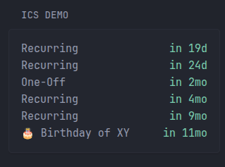

# iCal Event Widget for Glance

A lightweight API service that fetches iCal/ICS feeds and displays them as a custom widget in [Glance](https://github.com/glanceapp/glance).
Perfect for showing birthdays or recurring events from Nextcloud, SOGo, or any other calendar source right in your dashboard.


## ✨ Features

* Displays **ongoing** and **upcoming** events in separate lists
* Supports event links (one per widget) (`url`)
* Supports basic HTTP Authentication (username, password)
* Configurable limit for collapsible event lists
* Tested with Nextcloud & SOGo
* Works with Docker and NixOS

## ⚠️ Disclaimer

* This project is mainly maintained for my own use.
* **No guarantee** for stability or support – use at your own risk.
* The API is **not hardened** → do **not expose directly to the internet**.
  (Safe to run behind Glance itself.)
* I may use LLM's to Maintain this code. (Use at your own risk)

## 📦 Installation

### Prerequisites

* [Docker](https://www.docker.com/) & [Docker Compose](https://docs.docker.com/compose/)
* Glance stack (compose) or standalone installation
* Access to a valid ICS feed URL

### Setup

1. Add the service definition from `compose.yml` to your Glance compose stack
   *(or run it standalone).*
2. Start the stack:

   ```bash
   docker compose up -d --remove-orphans
   ```

### Advanced: NixOS

For NixOS users, there is a dedicated setup using flakes.
👉 See [NIX\_USAGE.md](./NIX_USAGE.md)

---

## 🚀 Usage

1. Add the widget configuration to your `glance.yml`.
2. Set the `url` parameter to your **raw** ICS feed URL, exactly as your calendar
   provider gave it to you (no manual URL-encoding needed — Glance encodes
   parameter values itself when it calls this API).
3. Reload or restart Glance.

**Tip:** For stability, use a **version tag** like `v1.0` instead of tracking `main`.
I May do breaking changes at any time.

> ⚠️ **Don't pre-encode the URL.** Earlier versions of this README suggested
> encoding the ICS URL yourself (e.g. with `urlencode.sh`) before adding it to
> `glance.yml`. Don't do this — Glance's `custom-api` widget already
> percent-encodes parameter values before sending the request, so encoding it
> yourself first results in it being encoded *twice* (e.g. Google Calendar's
> `%40` becomes `%2540`), which breaks the fetch. As of this version the
> service also defensively detects and repairs a double-encoded `url`
> parameter, but the recommended fix is to simply paste the URL unmodified.

---

## ⚙️ Configuration

### Parameters

| Parameter        | Description                                                                                   | Example / Default                |
| ---------------- | --------------------------------------------------------------------------------------------- | -------------------------------- |
| `url`            | Raw (not pre-encoded) ICS feed URL                                                             | `https://example.com/cal.ics`    |
| `limit`          | Number of events returned (applied AFTER ongoing events are prioritized)                      | `5` (omit for all)               |
| `lookback_days`  | How many days back from now to include events that already started (ensures ongoing coverage) | `14` (default)                   |
| `horizon_days`   | How many days into the future to fetch (upper bound to limit processing)                      | `3650` (default, ~10 years)      |
| `username`       | Username to use for basic HTTP authentication                                                 | `admin` (default, null)          |
| `password`       | Password to use for basic HTTP authentication                                                 | `12345` (default, null)          |

Notes:
* Ongoing events (already started, not yet ended) are always placed first before upcoming, regardless of `limit`.
* `limit` is applied only after sorting (so ongoing events are never excluded by the limit).
* Accepted ranges (safety clamped server‑side): `lookback_days` 0–90, `horizon_days` 1–3660.
* Additional per‑event fields you can use in your Glance template: `ongoing`, `secondsUntilStart`, `secondsUntilEnd`, `durationSeconds`, `daysRemaining` (for all‑day), and `source` (`icalevents` or `fallback`).

### Example Widget

```yaml
- type: custom-api
  title: iCal Events
  cache: 15m
  url: http://glances-ical-api:8076/events
  parameters:
    url: https://example.com/cal.ics
    limit: 5
  template: |
    {{ $events := .JSON.Array "events" }}
    {{ $count  := len $events }}
    {{ $limit  := 3 }}  <!-- how many upcoming to show before collapse -->

    {{ if eq $count 0 }}
      <div style="padding:8px 10px; border-radius:10px; background:var(--surface-2);">
        No entries found.
      </div>
    {{ end }}

    <!-- 1) Ongoing first (never collapsible) -->
    <ul class="list list-gap-10">
      {{ range $i, $e := $events }}
        {{ $ongoing := $e.Bool "ongoing" }}
        {{ if $ongoing }}
          {{ $start := $e.String "start" | parseTime "rfc3339" }}
          {{ $end   := $e.String "end"   | parseTime "rfc3339" }}
          {{ $name  := $e.String "name" }}
          {{ $url   := $e.String "url" }}
          <li>
            <div class="flex items-center justify-between gap-10">
              <!-- Left: name (highlight) + absolute date -->
              <div>
                {{ if $url }}
                  <a class="size-h3 color-highlight block text-truncate" href="{{ $url }}" target="_blank" rel="noreferrer" title="{{ $name }}">{{ $name }}</a>
                {{ else }}
                  <span class="size-h3 color-highlight block text-truncate" title="{{ $name }}">{{ $name }}</span>
                {{ end }}
                <div style="font-size:.85em;">{{ $start | formatTime "Mon, 02 Jan 2006" }}</div>
              </div>
              <!-- Right: relative time until END -->
              <div class="size-h3 color-primary" style="white-space:nowrap;">
                ends <span {{ $end | toRelativeTime }}></span>
              </div>
            </div>
          </li>
        {{ end }}
      {{ end }}
    </ul>

    <!-- 2) Upcoming, collapsible after $limit -->
    {{ $shown := 0 }}
    <ul class="list list-gap-10 collapsible-container" data-collapse-after="{{ $limit }}">
      {{ range $i, $e := $events }}
        {{ $ongoing := $e.Bool "ongoing" }}
        {{ if not $ongoing }}
          {{ $start := $e.String "start" | parseTime "rfc3339" }}
          {{ $name  := $e.String "name" }}
          {{ $url   := $e.String "url" }}
          <li {{ if ge $shown $limit }}class="collapsible-item"{{ end }}>
            <div class="flex items-center justify-between gap-10">
              <!-- Left: name (highlight) + absolute date -->
              <div>
                {{ if $url }}
                  <a class="size-h3 color-highlight block text-truncate" href="{{ $url }}" target="_blank" rel="noreferrer" title="{{ $name }}">{{ $name }}</a>
                {{ else }}
                  <span class="size-h3 color-highlight block text-truncate" title="{{ $name }}">{{ $name }}</span>
                {{ end }}
                <div style="font-size:.85em;">{{ $start | formatTime "Mon, 02 Jan 2006" }}</div>
              </div>
              <!-- Right: relative time until START -->
              <div class="size-h3 color-primary" style="white-space:nowrap;" {{ $start | toRelativeTime }}></div>
            </div>
          </li>
          {{ $shown = add $shown 1 }}
        {{ end }}
      {{ end }}
    </ul>
```

---

## 📸 Screenshots

### Small Widget



